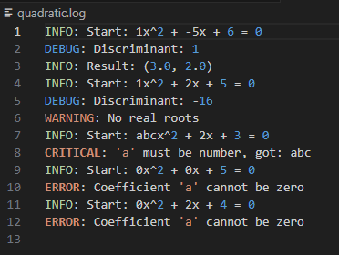
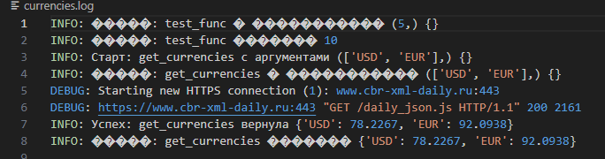
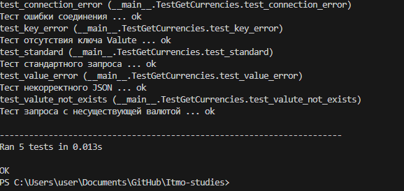

# Отчёт по лабораторной работе №7
# Выполнил Богун Андрей Витальевич
## Декораторы с параметрами. Логирование

---

## 1. Исходный код декоратора с параметрами

**Файл: `logger.py`**
```python
import logging
import io
import functools
import sys

logging.basicConfig(
    filename= "currencies.log",
    level= logging.DEBUG,
    format="%(levelname)s: %(message)s"
)
def logger(func=None, *, handle= sys.stdout):
    """Если декоратор вызван с параметрами: @logger(handle=...)"""
    if func is None:
        def wrapper(f):
            return logger(f, handle=handle)
        return wrapper
    
    """Если декоратор вызван без параметров: @logger"""
    @functools.wraps(func)
    def inner(*args, **kwargs):
        """Логируем начало вызова"""
        start_msg = f"Старт: {func.__name__} с аргументами {args} {kwargs}"
        
        if isinstance(handle, logging.Logger):
            handle.info(start_msg)
        else:
            handle.write(f"INFO: {start_msg}\n")
        
        try:
            """Выполняем функцию"""
            result = func(*args, **kwargs)
            
            """Логируем успешное завершение"""
            end_msg = f"Успех: {func.__name__} вернула {result}"
            
            if isinstance(handle, logging.Logger):
                handle.info(end_msg)
            else:
                handle.write(f"INFO: {end_msg}\n")
            
            return result
            
        except Exception as e:
            """Логируем ошибку"""
            error_msg = f"Ошибка: {func.__name__} - {type(e).__name__}: {str(e)}"
            
            if isinstance(handle, logging.Logger):
                handle.error(error_msg)
            else:
                handle.write(f"ERROR: {error_msg}\n")
            
            """Повторно выбрасываем исключение"""
            raise
    
    return inner
```

### Особенности реализации декоратора с параметрами
#### Декоратор logger реализован с поддержкой нескольких вариантов вызова, Преимущества такого подхода: Единый интерфейс для разных способов вызова, Гибкость настройки обработчика логирования, Сохранение информации об оригинальной функции


## 2. Исходный код get_currencies (без логирования)
**Файл: `lab7.py`**

```python
import requests
import sys

def get_currencies(currency_codes: list, url="https://www.cbr-xml-daily.ru/daily_json.js", handle= sys.stdout) -> dict:
    try:
        try:
            response = requests.get(url, timeout=10)
            response.raise_for_status()  
            """ Проверка HTTP ошибок"""
        except requests.exceptions.ConnectionError as e:
            raise ConnectionError(f"API недоступен: {e}") from e
        except requests.exceptions.Timeout as e:
            raise ConnectionError(f"Таймаут подключения к API: {e}") from e
        except requests.exceptions.RequestException as e:
            raise ConnectionError(f"Ошибка запроса к API: {e}") from e
        
        try:
            data = response.json()
        except ValueError as e:
            raise ValueError(f"Некорректный JSON в ответе API: {e}") from e


        response.raise_for_status() 
        """Проверка на ошибки HTTP"""
        data = response.json()
        currencies = {}

        if "Valute" in data:
            for code in currency_codes:
                if code in data["Valute"]:
                    currencies[code] = data["Valute"][code]["Value"]
                else:
                    currencies[code] = f"Код валюты '{code}' не найден."
        else:
            raise KeyError("В ответе API отсутствует ключ 'Valute'")
        return currencies

    except requests.exceptions.RequestException as e:
        print(f"Ошибка при запросе к API: {e}", file=handle)
        handle.write(f"Ошибка при запросе к API: {e}")
```

### Преимущества подхода с декоратором: Разделение ответственности: функция отвечает только за получение курсов, декоратор — за логирование, Повторное использование, Можно легко менять способ логирования (файл, консоль, удалённый сервис), Основная функция не засорена логикой логирования, Соблюдение принципа DRY

## 3. Демонстрационный пример
### Исходный код демонстрационного примера

**Файл: `Example.py`**
```python
import logging
import math
import functools

# Настройка логирования
logging.basicConfig(
    filename="quadratic.log",
    level=logging.DEBUG,
    format="%(levelname)s: %(message)s"
)

# Декоратор для логирования
def log_equation(func):
    @functools.wraps(func)
    def wrapper(a, b, c):
        logging.info(f"Start: {a}x^2 + {b}x + {c} = 0")
        
        # Проверка типов
        for name, val in zip(("a", "b", "c"), (a, b, c)):
            if not isinstance(val, (int, float)):
                logging.critical(f"'{name}' must be number, got: {val}")
                raise TypeError(f"Coefficient '{name}' must be numeric")
        
        if a == 0:
            logging.error("Coefficient 'a' cannot be zero")
            raise ValueError("a cannot be zero")
        
        try:
            result = func(a, b, c)
            if result is None:
                logging.warning("No real roots")
            else:
                logging.info(f"Result: {result}")
            return result
        except Exception as e:
            logging.error(f"Error: {type(e).__name__}: {str(e)}")
            raise
    
    return wrapper

# Чистая функция без логирования внутри
@log_equation
def solve_quadratic(a, b, c):
    """Solve quadratic equation ax² + bx + c = 0"""
    d = b*b - 4*a*c
    logging.debug(f"Discriminant: {d}")
    
    if d < 0:
        return None
    if d == 0:
        return (-b / (2*a),)
    
    return (
        (-b + math.sqrt(d)) / (2*a),
        (-b - math.sqrt(d)) / (2*a)
    )


if __name__ == "__main__":
    print("=== Демонстрация уровней логирования ===\n")
    
    # 1. INFO: два корня
    print("1. Два корня (INFO): x² - 5x + 6 = 0")
    try:
        result = solve_quadratic(1, -5, 6)
        print(f"   Результат: {result}")
    except Exception as e:
        print(f"   Ошибка: {e}")
    
    # 2. WARNING: дискриминант < 0
    print("\n2. Дискриминант < 0 (WARNING): x² + 2x + 5 = 0")
    try:
        result = solve_quadratic(1, 2, 5)
        print(f"   Результат: {result}")
    except Exception as e:
        print(f"   Ошибка: {e}")
    
    # 3. ERROR: некорректные данные
    print("\n3. Некорректные данные (ERROR): 'abc'x² + 2x + 3 = 0")
    try:
        result = solve_quadratic("abc", 2, 3)
        print(f"   Результат: {result}")
    except Exception as e:
        print(f"   Ошибка: {e}")
    
    # 4. CRITICAL: невозможная ситуация
    print("\n4. Невозможная ситуация (CRITICAL): 0x² + 0x + 5 = 0")
    try:
        result = solve_quadratic(0, 0, 5)
        print(f"   Результат: {result}")
    except Exception as e:
        print(f"   Ошибка: {e}")
    
    # 5. WARNING: линейное уравнение
    print("\n5. Линейное уравнение (WARNING): 0x² + 2x + 4 = 0")
    try:
        result = solve_quadratic(0, 2, 4)
        print(f"   Результат: {result}")
    except Exception as e:
        print(f"   Ошибка: {e}")
    
    print("\n=== Проверьте файл quadratic.log ===")
```


## 4. фрагменты логов ##


## 5. Тесты ##
### Исходный код тестов ##

```python
import unittest
import requests
from lab7 import get_currencies
from unittest.mock import patch, Mock


class TestGetCurrencies(unittest.TestCase):
    
    def test_standard(self):
        """Тест стандартного запроса"""
    
        mock_response = {
            "Valute": {
                "USD": {"Value": 76.0937},
                "EUR": {"Value": 88.7028},
                "JPY": {"Value": 49.0737}
            }
        }
        
        with patch('requests.get') as mock_get:
            mock_get.return_value.status_code = 200
            mock_get.return_value.json.return_value = mock_response
            
            result = get_currencies(['USD', 'EUR', 'JPY'])
            expected = {'USD': 76.0937, 'EUR': 88.7028, 'JPY': 49.0737}
            self.assertEqual(result, expected)
    
    def test_valute_not_exists(self):
        """Тест запроса с несуществующей валютой"""
        mock_response = {
            "Valute": {
                "USD": {"Value": 76.0937},
                "EUR": {"Value": 88.7028},
                "JPY": {"Value": 49.0737}
            }
        }
        
        with patch('requests.get') as mock_get:
            mock_get.return_value.status_code = 200
            mock_get.return_value.json.return_value = mock_response
            
            result = get_currencies(['USD', 'EUR', 'JPY', 'NNG'])
            self.assertAlmostEqual(result['USD'], 76.0937)
            self.assertAlmostEqual(result['EUR'], 88.7028)
            self.assertAlmostEqual(result['JPY'], 49.0737)
            self.assertEqual(result['NNG'], "Код валюты 'NNG' не найден.")
    
    def test_connection_error(self):
        """Тест ошибки соединения"""
        with patch('requests.get') as mock_get:
            mock_get.side_effect = requests.exceptions.ConnectionError("API недоступен")
            
            with self.assertRaises(ConnectionError):
                get_currencies(['USD', 'EUR', 'JPY'], url='https://invalid.url')
    
    def test_value_error(self):
        """Тест некорректного JSON"""
        with patch('requests.get') as mock_get:
            mock_response = Mock()
            mock_response.status_code = 200
            mock_response.json.side_effect = ValueError("Invalid JSON")
            mock_get.return_value = mock_response
            
            with self.assertRaises(ValueError):
                get_currencies(['USD', 'EUR', 'JPY'])
    
    def test_key_error(self):
        """Тест отсутствия ключа Valute"""
        mock_response = {
            "NotValute": {}
        }
        
        with patch('requests.get') as mock_get:
            mock_get.return_value.status_code = 200
            mock_get.return_value.json.return_value = mock_response
            
            with self.assertRaises(KeyError):
                get_currencies(['USD', 'EUR', 'JPY'])

if __name__ == "__main__":
    unittest.main(verbosity=2)
```








